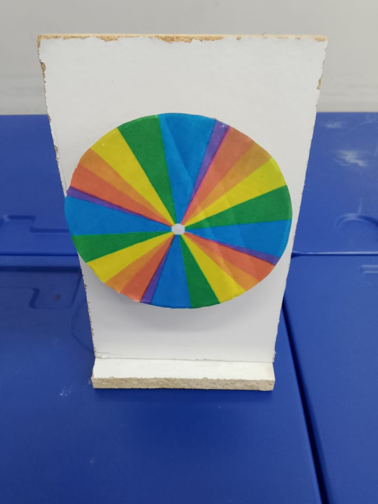
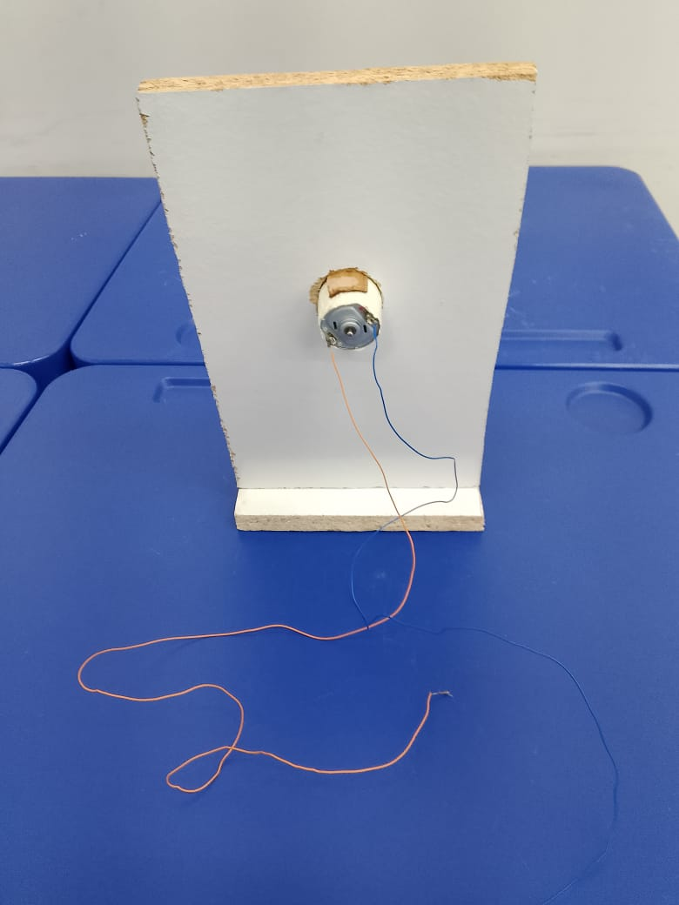
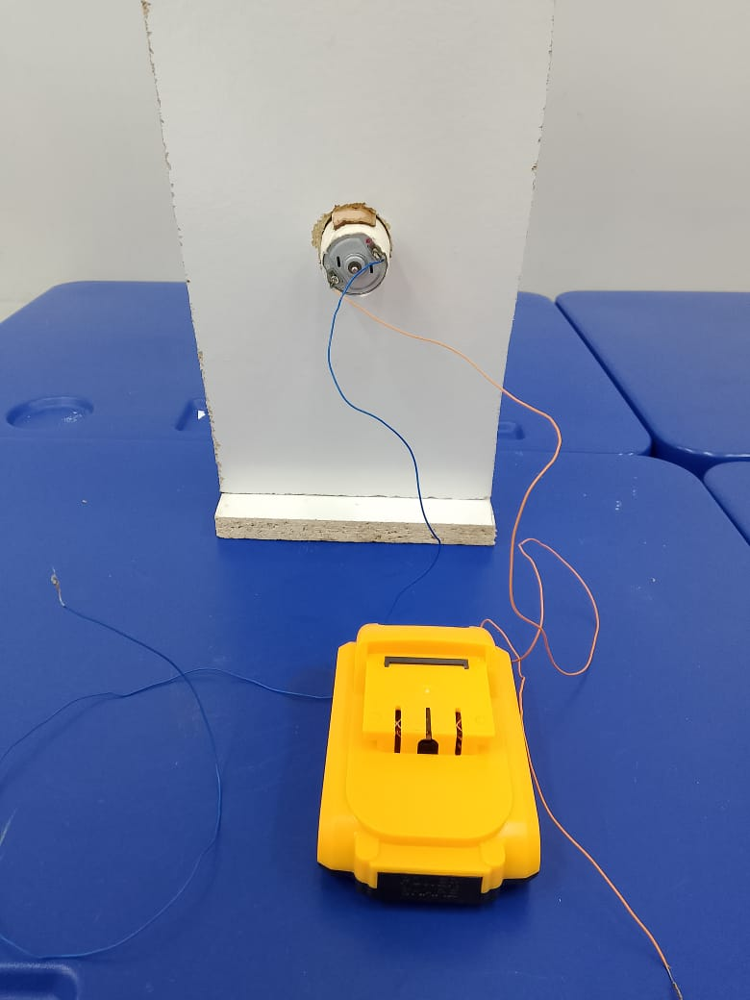
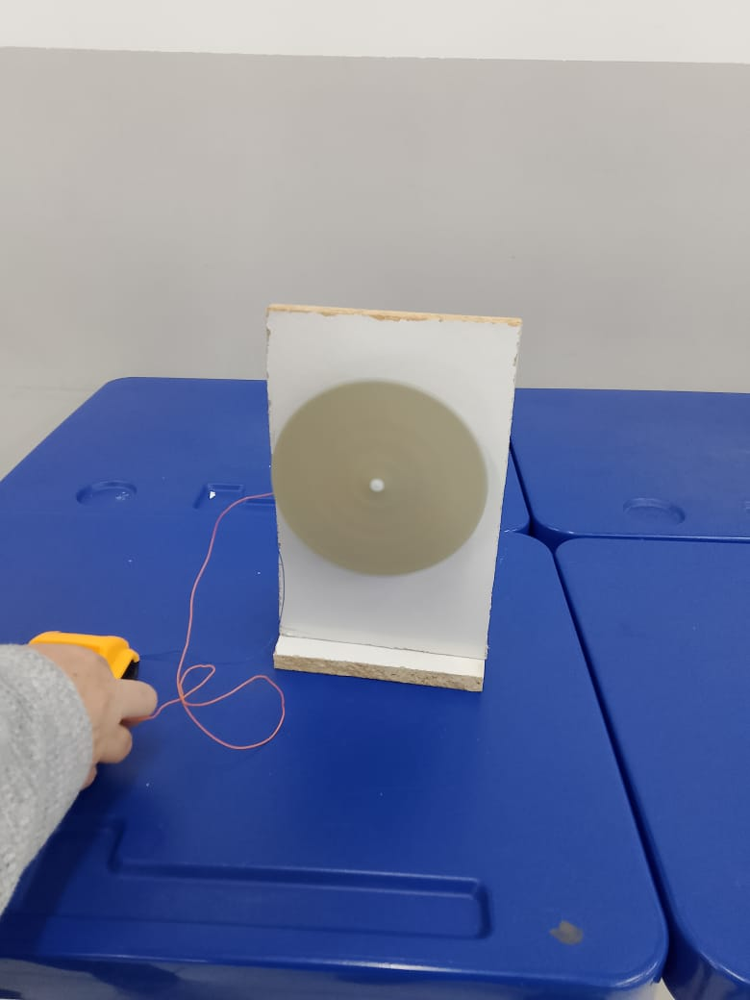

# Disco de Newton (Círculo Cromático de Newton)

## Autora: Joivana de Fátima Rodrigues Lau

## Introdução

O disco de Newton também conhecido como círculo cromático de Newton é um experimento amplamente reconhecido no campo da Física.A decomposição da luz observada no disco de Newton está intrinsecamente ligada ao experimento realizado por Isaac Newton com um prisma. Consiste em um disco colorido que incorpora as cores primárias do espectro visível, a saber, vermelho, laranja, amarelo, verde, azul, anil e violeta. 

A cor é uma característica física dos objetos, relacionada às suas propriedades de refração em diferentes comprimentos de onda [@Finlay2004]. Cada comprimento corresponde a uma cor específica do espectro cromático, que é a decomposição da luz visível. Esse espectro abrange tons que vão do vermelho ao azul violeta, com comprimentos além do vermelho sendo infravermelhos e abaixo do azul violeta ultravioleta, ambos invisíveis. Os comprimentos de onda refletidos pelos objetos entram nos nossos olhos e são interpretados pela retina, que forma a imagem que percebemos.
Quando o disco é colocado em rotação a altas velocidades, observa - se a composição da luz branca.

Em estado estacionário, a separação das cores é claramente perceptível; no entanto, ao girar o disco, as cores se misturam, resultando na aparência de um disco branco. Newton utilizou este 
dispositivo para evidenciar que a combinação das cores visíveis resulta na cor branca.

A decomposição da luz observada no disco de Newton está intrinsecamente ligada ao experimento realizado por Isaac Newton com um prisma. Newton evidenciou que a luz branca é constituída por diversas cores que, ao serem refratadas pelo prisma, formam o espectro visível. No disco de Newton, o fenômeno ocorre de maneira inversa: ao girar rapidamente o disco que contém as cores do arco-íris, as cores se amalgamam e nossos olhos percebem novamente a luz branca, demonstrando que a combinação das cores pode restituir a luz original.

Adicionalmente, é fundamental distinguir entre dois tipos de mistura de cores. Na mistura aditiva, que se dá com fontes de luz, as cores primárias (vermelho, verde e azul) se somam para gerar novas tonalidades, resultando na luz branca quando combinadas em sua totalidade. Na mistura subtrativa, que ocorre com pigmentos ou tintas, as cores primárias (ciano, magenta e amarelo) absorvem parte da luz; ao serem misturadas, tendem a produzir uma tonalidade próxima ao preto, uma vez que se dá a subtração das componentes luminosas refletidas.

## Objetivos

- Visualização da composição da luz em razão do fenômeno da persistência da luz

- Compreender o fenômeno de decomposição da luz branca e sua recomposição através das sete cores do espectro visível (vermelho,laranja,amarelo,verde,azul,anil e violeta). E reconhecer que a luz branca resulta da soma das cores que compõem o espectro. 

- Relacionar o experimento ao estudo da óptica e física da luz.

-Relacionar a experiência ao conceito de síntese aditiva de cores da luz. 

## Parte experimental

### Materiais utilizados

Uma cartolina branca ou papelão, marcadores ou tinta com as cores vermelho, laranja, amarelo, verde, azul, anil e violeta,cola branca, tesoura,régua,compasso,lápis,furador de papel,fita de qualquer tipo (adesiva, isolante ou de vedação), uma base de MDF 26 × 16, uma placa de  MDF 16×6, 4 parafusos, bateria 24 V, motor 12 V, serra circular,dois fios de cobre, serra copo e parafusadeira.

### Procedimento experimental

#### Preparação da base

1. Corte um MDF 26 × 16. Com o serra copo,faça um círculo  no centro da madeira.

2. Acople o motor de 12v.

3. Insira uma das pontas do fio de cobre na parte positiva do motor e a outra ponta no terminal na parte negativa. 

4. Corte um novo  MDF 16×6  para servir como base, parafuse essa madeira menor na parte inferior da madeira maior. 

#### Preparação do disco

1. Com o compasso, faça um círculo na folha de cartolina e um círculo no papelão . O tamanho aqui não é importante, porém, se o disco for muito grande, o efeito da composição da luz branca será menos visível;

2. Com a régua e o lápis, faça divisões triangulares no círculo da folha de cartolina, todas com o mesmo tamanho, como uma pizza.                                                         

3. Pinte os triângulos e certifique-se de todo o espaço estar totalmente colorido e sem falhas;                                                                                                   4. Faça um pequeno furo circular no centro dos círculos com o furador de papel.Passe cola branca e faça um apoio com um novo circulo de papelão.

5. Acople esse disco na haste do motor de 12V. Na sequência conecte uma das pontas do fio de cobre ao  polo positivo e a outra ponta ao polo negativo da bateria de 24V.                                                                                                                    
6. Finalmente  é só garantir a rotação do disco. Quanto mais rápido o disco girar, maior será o efeito da composição da luz branca sobre os nossos olhos.

```{r figura-5a, fig.cap="Disco de Newton estático, com as sete cores separadas utilizado para demonstrar a composição da luz branca."}

```

```{r figura-5b, fig.cap="Montagem do disco de Newton."}

```

```{r figura-5c, fig.cap="Montagem experimental do Disco de Newton conectado a um motor elétrico de 12 volts, alimentado por uma bateria de 24 volts, permitindo alta rotação para demonstrar a mistura das cores e a formação da cor branca."}

```

```{r figura-5d, fig.cap="Disco de Newton em movimento.Ao girar, as cores se misturam visualmente, resultando na percepção de cor branca."}

```

## Questionário

1. O que é o Disco de Newton ? A luz branca é formada por quais cores?

2. O que se observa quando o disco está parado? E quando o disco está girando rapidamente?

3. Explique por que o disco parece ficar branco quando gira, mesmo estando pintado com várias cores.

4. Qual a diferença entre a mistura de cores de luz (adição) e a mistura de cores de tinta (subtração)?

5. Como esse experimento pode ser relacionado ao arco-íris?

6. Se o disco de Newton fosse pintado com cores desiguais (por exemplo, mais vermelho e menos azul), o que mudaria na observação ao girar?

7. Explique, com suas palavras, a importância desse experimento para a compreensão da natureza da luz.
