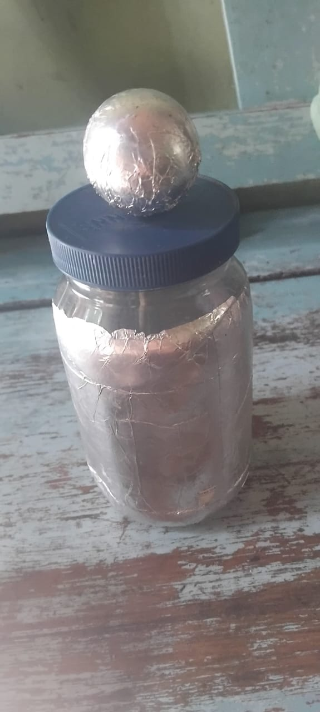

# Capacitor caseiro Garrafa de Leiden

## Autora: Sabrina Vitoria Wersel

## Introdução

A garrafa de Leiden é um capacitor caseiro que pode ser facilmente construído com materiais simples, permitindo armazenar energia elétrica. Consiste em um recipiente isolante (vidro ou plástico) com um condutor interno e um externo. Para usá-la, conecta-se o condutor interno a uma fonte eletrostática para acumular cargas elétricas; quando o contato é feito com a camada externa, a energia é liberada, produzindo uma descarga, ou seja, uma faísca. 

A bilha de Leiden, também conhecida como Garrafa de Leiden, é um dispositivo histórico que desempenhou um papel importante no desenvolvimento da eletricidade. Inventada no século 18 pelo físico Pieter Van Musschenbroek, esta garrafa consiste em um recipiente de vidro com revestimento interno e externo de metal, separados por um isolante. Seu descobrimento revolucionou o campo da eletrostática e ajudou a avançar no estudo da eletricidade. 

## Objetivos

* Explicar o funcionamento da garrafa de Leiden de forma claraa e acessível, como a garrafa acumula carga elétrica e como isso está relacionado ao princípio da eletricidade estática; 

* Despertar o interesse dos alunos pelo estudo da eletricidade, através de atividades práticas e interativas; 

* Explorar as aplicações históricas da Garrafa de Leiden, em como auxíliou em descobertas científicas; 

## Parte experimental

### Materiais utilizados

* Um recipiente: Pode ser uma garrafa de vidro, pote de plástico ou caixa de comprimidos. 

* Papel alumínio

* Palito de madeira  

* Cola quente

* Bola de pingue-pongue 

* Fio de cobre

* Fita isolante

### Procedimento experimental

a. revestir o pote de plástico com papel alumínio por dentro e por fora;

b. Cortar o palito de madeira até o tamanho do recipiente usado 

c. fazer um furo na tampa do pote e na bolinha de pingue pongue; 

d. fixar o palito de madeira dentro do furo da bolinha, em seguida revestir a bolinha com papel alumínio e colar uma das extremidades do fio de cobre no palito de modo que encoste no papel alumínio da bolinha de pingue-pongue; 

c. atravessar a outra extremidade do palito dentro da tampa do recipiente; 

d. fixar a outra extremidade do fio de cobre no papel alumínio de dentro do pote; 

e. atritar um cano de pvc com papel, (ou uma bexiga de plástico sobre os cabelos) em seguida encostar o material atritado sobre a esfera de alumínio para a passagem de cargas. 

```{r}
#| label: figura-6a
#| fig.cap: "Imagem da garafa de Leiden após a montagem."

```

## Questionário

1. Por que a garrafa de leiden consegue armazenar energia? 

2. Explique porque levamos um choque quando tocamos na esfera de alumínio da garrafa de leiden. 

3. Em termos de eletricidade, o que acontece quando atritamos o cano de pvc com um papel toalha?
